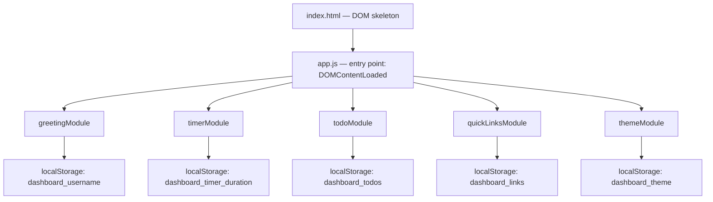

# Design Document: To-Do List Life Dashboard

## Overview

The To-Do List Life Dashboard is a zero-dependency, single-page web application that runs entirely in the browser from a single `index.html`. It provides five functional widgets — a live greeting/clock, a Pomodoro focus timer, a persistent to-do list, a quick-links panel, and a light/dark theme toggle — all persisted via `localStorage`.

The application is composed of exactly three files:

| File | Role |
|------|------|
| `index.html` | Page structure and widget markup |
| `style.css` | Layout, theming (light/dark CSS variables), and responsive breakpoints |
| `app.js` | All runtime logic (no external libraries) |

No build step, no server, no framework. The user opens `index.html` directly in any modern browser.

### Design Goals

- **Simplicity**: Plain HTML/CSS/JS — readable by any developer without toolchain knowledge.
- **Persistence**: All user data survives page reloads via `localStorage`.
- **Resilience**: Every feature degrades gracefully when `localStorage` is unavailable or browser APIs are restricted (e.g., Notifications denied).
- **Responsiveness**: Single-column layout below 768 px, multi-column above.

---

## Architecture

The app follows a **widget-module** architecture. `app.js` is divided into self-contained modules — one per widget — each owning its own state, DOM manipulation, and `localStorage` interaction. There is no shared global mutable state beyond the DOM and `localStorage`.



### Initialization Sequence

On `DOMContentLoaded`, `app.js` executes modules in this order:

1. **themeModule.init()** — applies saved/OS theme before any paint (no flash)
2. **greetingModule.init()** — reads saved name, starts the 1-second clock interval
3. **timerModule.init()** — restores saved duration, wires up timer buttons
4. **todoModule.init()** — loads task array, renders list
5. **quickLinksModule.init()** — loads link array, renders panel

`themeModule` is intentionally first because it must apply the `data-theme` attribute to `<html>` before the browser renders visible content.

---

## Components and Interfaces

### 1. Greeting Widget (`greetingModule`)

**Responsibilities**: Display current time, date, and context-aware greeting with optional user name.

**DOM targets** (selected once on init, stored in module scope):
- `#clock` — live time display
- `#date` — full date string
- `#greeting` — greeting text ("Good Morning", etc.)
- `#name-input` — text input for custom name
- `#name-form` — form wrapping the name input

**Public interface**:
```js
greetingModule.init()        // reads localStorage, starts setInterval(tick, 1000)
greetingModule.updateName()  // called on form submit; saves/clears name in localStorage
```

**Clock tick logic**:
- Uses `new Date()` on every tick.
- Time format: `toLocaleTimeString()` with no explicit locale, relying on the browser's detected locale — this naturally yields 12 h or 24 h per the user's system setting.
- Date format: `toLocaleDateString('en-US', { weekday:'long', year:'numeric', month:'long', day:'numeric' })` → "Monday, June 15, 2026".
- Greeting tier determined by `date.getHours()`:
  - 5–11 → "Good Morning"
  - 12–16 → "Good Afternoon"
  - 17–20 → "Good Evening"
  - 21–23, 0–4 → "Good Night"

---

### 2. Focus Timer (`timerModule`)

**Responsibilities**: Configurable countdown timer with start/stop/reset, browser notification on completion, and duration persistence.

**DOM targets**:
- `#timer-display` — MM:SS readout
- `#timer-duration-input` — numeric input (1–120)
- `#timer-start` — Start button
- `#timer-stop` — Stop/Pause button
- `#timer-reset` — Reset button
- `#timer-alert` — in-page banner shown when notification is unavailable

**Internal state** (module-scoped variables):
```js
let intervalId   = null;   // setInterval handle; null when not running
let remaining    = 0;      // seconds remaining in current session
let configuredMs = 0;      // seconds for the configured duration (reset target)
let isRunning    = false;
```

**Key behaviors**:
- `start()`: Guards against double-start (`isRunning` check). Disables duration input. Calls `setInterval(tick, 1000)`.
- `stop()`: Clears interval, sets `isRunning = false`, re-enables duration input.
- `reset()`: Calls `stop()`, restores `remaining = configuredMs`, updates display, re-enables duration input.
- `tick()`: Decrements `remaining`. If `remaining <= 0`, calls `stop()` then `notifyComplete()`.
- `notifyComplete()`: Requests Notification permission if not yet granted. Fires a Notification if permitted; otherwise shows `#timer-alert` banner.
- Duration input validation: `input` event listener clamps and rounds the value; reverts to last valid value on blur if invalid.

---

### 3. To-Do List (`todoModule`)

**Responsibilities**: CRUD operations on a task array with inline editing, completion toggling, and full `localStorage` persistence.

**DOM targets**:
- `#todo-input` — new task text field
- `#todo-add-btn` — Add button
- `#todo-list` — `<ul>` container rendered via `renderList()`
- `#todo-input-error` — inline validation message span

**Task data shape**:
```js
{
  id: string,          // crypto.randomUUID() or Date.now().toString() fallback
  text: string,        // trimmed task description
  completed: boolean   // false on creation
}
```

**Rendering strategy**: Full re-render on every state change. `renderList()` clears `#todo-list` innerHTML and rebuilds all `<li>` elements from the current array. This keeps the render logic simple; performance is acceptable because task lists are small (< 1000 items in a personal productivity app).

**Edit mode**: When a task enters edit mode, its `<li>` is re-rendered in place with an `<input>` pre-filled with the current text, a Save button, and a Cancel button. Only one task can be in edit mode at a time (entering edit on a second task implicitly cancels the first, since re-render replaces all DOM).

---

### 4. Quick Links (`quickLinksModule`)

**Responsibilities**: Add, display, and delete named URL shortcuts; enforce 20-item maximum; auto-prepend `https://` when missing.

**DOM targets**:
- `#link-label-input` — label text field
- `#link-url-input` — URL text field
- `#link-add-btn` — Add Link button
- `#links-container` — rendered link list
- `#link-label-error` / `#link-url-error` — inline validation spans
- `#links-limit-msg` — max-limit banner

**Link data shape**:
```js
{
  id: string,    // crypto.randomUUID() or Date.now().toString() fallback
  label: string, // trimmed label (max 50 chars)
  url: string    // normalized URL (https:// prepended if needed)
}
```

**URL normalization**: Before saving, if `url.toLowerCase()` does not start with `http://` or `https://`, prepend `https://`.

**Maximum enforcement**: After every add/delete, check `links.length`. If `=== 20`, disable `#link-add-btn` and show `#links-limit-msg`. If `< 20`, enable button and hide message.

---

### 5. Theme Toggle (`themeModule`)

**Responsibilities**: Apply and persist light/dark theme; read OS preference as fallback; prevent flash of unstyled content.

**DOM target**:
- `#theme-toggle` — button (fixed position in CSS)
- `<html>` element — receives `data-theme="light"` or `data-theme="dark"` attribute

**CSS approach**: All color values are defined as CSS custom properties under `[data-theme="light"]` and `[data-theme="dark"]` selectors on `:root`. No class swapping — only the `data-theme` attribute on `<html>` changes.

```css
[data-theme="light"] {
  --bg: #ffffff;
  --text: #1a1a1a;
  /* ... */
}
[data-theme="dark"] {
  --bg: #1a1a1a;
  --text: #f0f0f0;
  /* ... */
}
```

**Init sequence**: `themeModule.init()` runs synchronously (no async) before any other module. It reads `localStorage`, falls back to `prefers-color-scheme`, then falls back to `"light"`. Sets `document.documentElement.setAttribute('data-theme', theme)` immediately. Because this runs in a `<script defer>` at end of `<body>` (or `DOMContentLoaded` before paint), no FOUC occurs.

**localStorage unavailability**: All `localStorage` calls in `themeModule` are wrapped in `try/catch`. If storage is unavailable, the module continues with the OS/default theme for the session.

---

## Data Models

All persistence uses `localStorage`. Keys are namespaced with the `dashboard_` prefix to avoid collisions.

### Storage Schema

| Key | Type | Description |
|-----|------|-------------|
| `dashboard_username` | `string` | Trimmed user name; absent/empty means no name set |
| `dashboard_timer_duration` | `string` (numeric) | Configured timer duration in minutes (1–120) |
| `dashboard_todos` | `string` (JSON) | Serialized `Task[]` array |
| `dashboard_links` | `string` (JSON) | Serialized `Link[]` array |
| `dashboard_theme` | `string` | `"light"` or `"dark"` |

### Type Definitions

```js
/**
 * @typedef {Object} Task
 * @property {string}  id        - Unique identifier
 * @property {string}  text      - Task description (non-empty, trimmed)
 * @property {boolean} completed - Completion state
 */

/**
 * @typedef {Object} Link
 * @property {string} id    - Unique identifier
 * @property {string} label - Display label (non-empty, trimmed, max 50 chars)
 * @property {string} url   - Normalized URL (starts with http:// or https://)
 */
```

### Serialization

- Reading: `JSON.parse(localStorage.getItem(key) ?? 'null')` — returns `null` on miss, which modules treat as "no data".
- Writing: `localStorage.setItem(key, JSON.stringify(value))` — called synchronously after every state mutation.
- All `localStorage` access is wrapped in `try/catch` per module to handle `SecurityError` in restricted contexts (private browsing with storage disabled).

---

## Correctness Properties

*A property is a characteristic or behavior that should hold true across all valid executions of a system — essentially, a formal statement about what the system should do. Properties serve as the bridge between human-readable specifications and machine-verifiable correctness guarantees.*

### Property 1: Greeting tier is a complete partition of all hours

*For any* integer hour in the range [0, 23], `getGreeting(hour)` SHALL return exactly one of "Good Morning", "Good Afternoon", "Good Evening", or "Good Night". Hours 5–11 return "Good Morning", hours 12–16 return "Good Afternoon", hours 17–20 return "Good Evening", and hours 0–4 and 21–23 return "Good Night". No hour is left unclassified.

**Validates: Requirements 1.3, 1.4, 1.5, 1.6**

---

### Property 2: Greeting name suffix is consistent with stored name

*For any* hour in [0, 23] and any non-empty trimmed name string (length 1–50), `formatGreeting(hour, name)` SHALL equal `getGreeting(hour) + ", " + name`. For any hour with a null, empty, or whitespace-only name, `formatGreeting` SHALL equal `getGreeting(hour)` with no suffix appended.

**Validates: Requirements 1.7, 1.8**

---

### Property 3: Name persistence round-trip

*For any* non-empty trimmed string of length 1–50, saving it as the username to `localStorage` then loading it back SHALL return the identical string. For any whitespace-only or empty string submitted as the username, loading afterwards SHALL return null or empty (no name stored).

**Validates: Requirements 2.2, 2.4, 2.5**

---

### Property 4: Timer display format covers full duration range

*For any* integer number of seconds in [0, 7200] (representing 0 to 120 minutes), `formatTime(seconds)` SHALL return a string matching the pattern `MM:SS` where MM is the zero-padded minutes and SS is the zero-padded remaining seconds.

**Validates: Requirements 3.2**

---

### Property 5: Timer duration clamping keeps values in valid range

*For any* numeric input to the duration clamp function, the output SHALL always be an integer in [1, 120]. Inputs below 1 are clamped to 1; inputs above 120 are clamped to 120; fractional values are floored or rounded to the nearest integer within range.

**Validates: Requirements 3.7**

---

### Property 6: Timer duration round-trip persistence

*For any* valid integer duration d in [1, 120], calling `saveDuration(d)` then `loadDuration()` SHALL return d, so that the configured duration is faithfully restored across page loads.

**Validates: Requirements 3.11**

---

### Property 7: Task addition grows the list and preserves existing items

*For any* task array and any non-empty trimmed task description string, calling `addTask(arr, text)` SHALL return an array whose length is `arr.length + 1`, whose first `arr.length` items are identical to the original array, and whose last item has `text` equal to the trimmed input and `completed` equal to `false`.

**Validates: Requirements 4.2**

---

### Property 8: Whitespace-only task text is rejected at add and edit

*For any* string composed entirely of whitespace characters (spaces, tabs, newlines), both `addTask` and `editTask` SHALL reject the input, leaving the task array unchanged and returning a validation error indicator.

**Validates: Requirements 4.3, 4.9**

---

### Property 9: Task serialization round-trip preserves all fields

*For any* array of Task objects, `JSON.parse(JSON.stringify(tasks))` SHALL produce an array of equal length where every item has the same `id`, `text`, and `completed` values as the original.

**Validates: Requirements 4.12, 4.13**

---

### Property 10: Task completion toggle is an involution

*For any* task, calling `toggleComplete` twice in succession SHALL return a task with the same `id`, `text`, and original `completed` state — i.e., double-toggling is a no-op.

**Validates: Requirements 4.5, 4.6**

---

### Property 11: Task deletion removes exactly the target item

*For any* task array with at least one item and any task ID present in that array, `deleteTask(arr, id)` SHALL return an array of length `arr.length - 1` that contains no item with the given `id`, and all other items remain present and unchanged.

**Validates: Requirements 4.11**

---

### Property 12: URL normalization is idempotent

*For any* URL string, applying `normalizeUrl` twice SHALL produce the same result as applying it once. Additionally, for any string already starting with `http://` or `https://` (case-insensitive), `normalizeUrl` SHALL return it unchanged.

**Validates: Requirements 5.4**

---

### Property 13: Link serialization round-trip preserves all fields

*For any* array of Link objects, `JSON.parse(JSON.stringify(links))` SHALL produce an array of equal length where every item has the same `id`, `label`, and `url` values as the original.

**Validates: Requirements 5.8, 5.9**

---

### Property 14: Quick Links maximum enforcement

*For any* link array of exactly 20 items and any valid new link, `addLink(arr, label, url)` SHALL reject the addition and return the original array unchanged (length remains 20).

**Validates: Requirements 5.10**

---

### Property 15: Theme toggle is an involution

*For any* theme value in `{"light", "dark"}`, applying `toggleTheme` twice SHALL return the original theme value. Applying it once SHALL return the opposite value.

**Validates: Requirements 6.2, 6.3**

---

### Property 16: Theme persistence round-trip

*For any* theme value in `{"light", "dark"}`, calling `saveTheme(t)` then `loadTheme()` SHALL return `t`, so that the active theme is faithfully restored across page loads.

**Validates: Requirements 6.4, 6.5**

---

## Error Handling

### localStorage Unavailability

Every module wraps `localStorage` reads and writes in `try/catch`:

```js
function safeGet(key) {
  try { return localStorage.getItem(key); }
  catch { return null; }
}

function safeSet(key, value) {
  try { localStorage.setItem(key, value); }
  catch { /* silent fail — session-only state */ }
}
```

When storage is blocked, all widgets function normally for the current session; data simply does not persist across reloads. No errors are thrown to the console.

### Notification API Unavailability

`timerModule.notifyComplete()` uses the following guard:

```js
if ('Notification' in window && Notification.permission === 'granted') {
  new Notification('Focus session complete!');
} else {
  document.getElementById('timer-alert').textContent = 'Focus session complete!';
  document.getElementById('timer-alert').hidden = false;
}
```

If `Notification` is not supported or permission is denied/not-yet-requested, the in-page banner is always shown.

### JSON Parse Errors

When reading arrays from `localStorage`, a `try/catch` around `JSON.parse` ensures a corrupted value falls back to an empty array:

```js
function loadArray(key) {
  try { return JSON.parse(localStorage.getItem(key)) ?? []; }
  catch { return []; }
}
```

### Input Validation Errors

Inline error messages are shown adjacent to the relevant input field and cleared on the next valid submission or input change. No alerts or modal dialogs are used.

---

## Testing Strategy

### Assessment: Is Property-Based Testing Applicable?

This feature is a Vanilla JS single-page application with both pure logic functions and UI interaction layers.

**PBT IS applicable** to the pure logic functions:
- Greeting tier classification (pure function of hour integer)
- Name/task/link validation (pure string functions)
- URL normalization (pure string function)
- `localStorage` serialization/deserialization round-trips
- Timer duration clamping (pure numeric function)
- Theme toggle (two-state involution)

**PBT is NOT appropriate** for:
- DOM rendering (use snapshot/example tests)
- `setInterval`-based timer ticks (use fake timers with example tests)
- Browser Notification API (mock-based unit test)
- Responsive layout (manual/visual testing)

### Recommended Testing Library

**[fast-check](https://github.com/dubzzz/fast-check)** (JavaScript) — mature, well-documented property-based testing library. Works with any test runner (Jest, Vitest).

Minimum **100 iterations** per property test.

Each property test is tagged with a comment:

```js
// Feature: todo-life-dashboard, Property 6: Task addition grows the list
```

### Unit Tests (Example-Based)

Focus on specific scenarios and integration points:

| Test | Description |
|------|-------------|
| Clock displays correct format | Verify 12 h / 24 h output matches locale |
| Greeting shows correct tier | Example for each of the 4 tiers |
| Timer counts down | Verify `remaining` decrements each tick |
| Timer auto-stops at zero | Verify `intervalId` cleared when `remaining === 0` |
| Add button disabled at 20 links | Concrete boundary example |
| Theme applies correct attribute | `data-theme` set on `<html>` element |

### Property Tests (Universal Properties)

Each maps directly to a Correctness Property in this document:

| Test | Property | fast-check arbitraries |
|------|----------|------------------------|
| Greeting tier is complete partition | Property 1 | `fc.integer({ min: 0, max: 23 })` |
| Greeting name suffix consistency | Property 2 | `fc.integer({ min: 0, max: 23 })`, `fc.string({ minLength: 1, maxLength: 50 }).filter(s => s.trim().length > 0)` |
| Name persistence round-trip | Property 3 | `fc.string({ minLength: 1, maxLength: 50 }).filter(s => s.trim().length > 0)`, `fc.stringOf(fc.constantFrom(' ', '\t', '\n'))` |
| Timer display format MM:SS | Property 4 | `fc.integer({ min: 0, max: 7200 })` |
| Duration clamping to [1, 120] | Property 5 | `fc.integer()` (unbounded) |
| Duration persistence round-trip | Property 6 | `fc.integer({ min: 1, max: 120 })` |
| Task addition grows list | Property 7 | `fc.array(taskArb)`, `fc.string().filter(s => s.trim().length > 0)` |
| Whitespace task/edit rejected | Property 8 | `fc.array(taskArb)`, `fc.stringOf(fc.constantFrom(' ', '\t', '\n'))` |
| Task serialization round-trip | Property 9 | `fc.array(taskArb)` |
| Task completion toggle involution | Property 10 | `taskArb` |
| Task deletion removes only target | Property 11 | `fc.array(taskArb, { minLength: 1 })` |
| URL normalization idempotent | Property 12 | `fc.webUrl()`, `fc.string()` |
| Link serialization round-trip | Property 13 | `fc.array(linkArb)` |
| Quick Links max enforcement | Property 14 | `fc.array(linkArb, { minLength: 20, maxLength: 20 })`, `linkArb` |
| Theme toggle involution | Property 15 | `fc.constantFrom('light', 'dark')` |
| Theme persistence round-trip | Property 16 | `fc.constantFrom('light', 'dark')` |

### Integration / Manual Tests

- Open `index.html` in Chrome, Firefox, Edge, Safari — verify all widgets render and function.
- Resize to 320 px width — verify single-column layout, no horizontal scroll.
- Disable `localStorage` (private browsing) — verify graceful degradation, no console errors.
- Deny Notification permission — verify in-page banner appears at timer end.
- Reload page after interacting with all widgets — verify all state is restored correctly.
